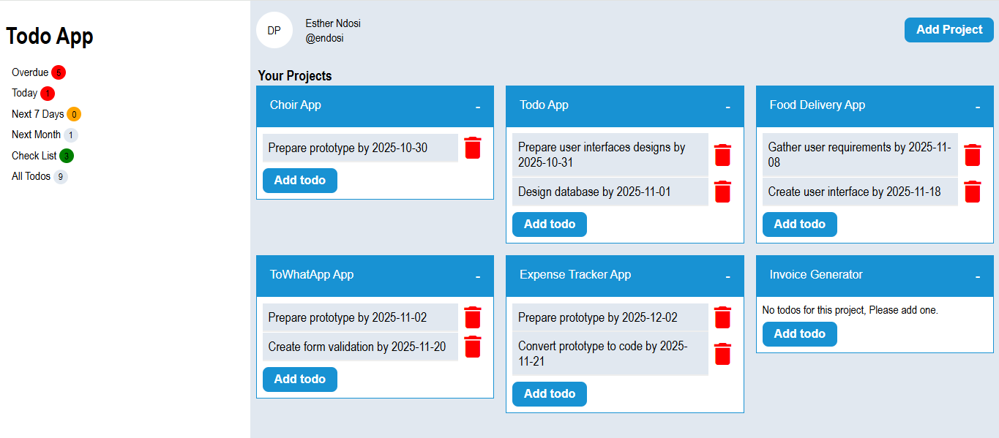

# Todo App

A small client-side todo list app built with plain HTML, CSS and JavaScript.


Briefly:
- Add projects and todos.
- View project cards that collapse/expand.
- Delete todo and update todo status
- Persist data in `localStorage`.
- View counts for overdue, today, week, month, done and all.

Usage
-----

- For development, use the Live Server extension in VS Code or a simple static server:

```powershell
python -m http.server 8000
# then open http://localhost:8000 in the browser
```
- [Live Demo](https://ndosie.github.io/todo-list/) - See it in action

Files
-----

- `index.html` — main page and markup
- `styles/styles.css` — all styles
- `scripts/script.js` — application logic and UI handlers
- `modal/modals.js` — Project and Todo classes (model)
- `service/local_storage.js` — simple persistence helpers (retrieve/save/update)

Notes
-----

- The app stores projects and todos in `localStorage`. When objects are saved and later parsed from JSON, prototype methods (class methods) are not preserved — only the data fields (title, dueDate, status, id, etc.) remain.
- IDs used in the UI are prefixed (for example `todo-<id>`) to avoid selector issues with numeric-only ids.

Next steps (suggested)
----------------------

1. Implement Update functionality for todos and projects
	- Add delete buttons in the UI (project-level and todo-level). Wire an "Edit" form/modal that lets users change `title`, `dueDate`, `priority`, and `status`, then call `update('todos', todoId, changes)` and refresh the UI.

2. Improve UX
	- Add confirmations for destructive actions (delete), better input validation feedback, and keyboard accessibility for dialogs.